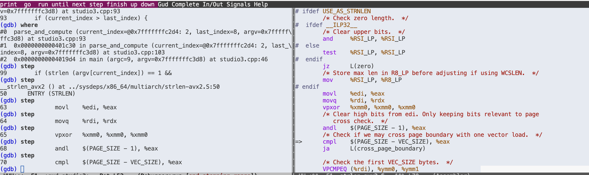

# Studio3
written by Zihan Chen

## test1
When running `./studio3 + + + 1 1 1 2`, the result is as following.
```bash
./studio3 + + + 1 1 1 2
The value calculated is 5

echo $?
0
```

When running `./studio3 + + + 1 1 1`, the result is as following.
```bash
./studio3 + + + 1 1 1
caught exception for unexpected end of expression.

echo $?
2
```

## test2
Use `gdb studio3` command.
```bash
[chensteven@iht32-1504.sif studio3]$ gdb studio3 
GNU gdb (GDB) Rocky Linux 8.2-20.el8.0.1
Copyright (C) 2018 Free Software Foundation, Inc.
License GPLv3+: GNU GPL version 3 or later <http://gnu.org/licenses/gpl.html>
This is free software: you are free to change and redistribute it.
There is NO WARRANTY, to the extent permitted by law.
Type "show copying" and "show warranty" for details.
This GDB was configured as "x86_64-redhat-linux-gnu".
Type "show configuration" for configuration details.
For bug reporting instructions, please see:
<http://www.gnu.org/software/gdb/bugs/>.
Find the GDB manual and other documentation resources online at:
    <http://www.gnu.org/software/gdb/documentation/>.

For help, type "help".
Type "apropos word" to search for commands related to "word"...
Reading symbols from studio3...done.
```

## test3
```
(gdb) b parse_and_compute
Breakpoint 1 at 0x401c2d: file studio3.cpp, line 93.
```

## test4
```
(gdb) run + 1 + 2 + 3 4
Starting program: /home/warehouse/chensteven/cse428_24fall/studio3/studio3 + 1 + 2 + 3 4
warning: Found SQLITE rpmdb.sqlite database while attempting bdb backend: using sqlite backend.
warning: Found SQLITE rpmdb.sqlite database while attempting bdb backend: using sqlite backend.
warning: Found SQLITE rpmdb.sqlite database while attempting bdb backend: using sqlite backend.

Breakpoint 1, parse_and_compute (current_index=@0x7fffffffc314: 1, last_index=7, argv=0x7fffffffc418) at studio3.cpp:93
93        if (current_index > last_index) {        
Missing separate debuginfos, use: yum debuginfo-install libgcc-11.4.1-3.el9.x86_64 libstdc++-11.4.1-3.el9.x86_64
(gdb) c
Continuing.

Breakpoint 1, parse_and_compute (current_index=@0x7fffffffc314: 2, last_index=7, argv=0x7fffffffc418) at studio3.cpp:93
93        if (current_index > last_index) {  
```

## test5

```
(gdb) where
#0  parse_and_compute (current_index=@0x7fffffffc314: 2, last_index=7, argv=0x7fffffffc418) at studio3.cpp:93
#1  0x0000000000401cec in parse_and_compute (current_index=@0x7fffffffc314: 2, last_index=7, argv=0x7fffffffc418) at studio3.cpp:103
#2  0x0000000000401a90 in main (argc=8, argv=0x7fffffffc418) at studio3.cpp:46
```

## test6
```
(gdb) print current_index
$1 = (int &) @0x7fffffffc314: 2
(gdb) print argv[2]
$2 = 0x7fffffffca31 "1"
```

## Additional 7
When I use step, I can run more deeply into a c source code.
Here, I can find it use a c library strlen-avx2 function, and then I can also see how the code runs in Assembly.

```
(gdb) step
99        if (strlen (argv[current_index]) == 1 && 
(gdb) step
__strlen_avx2 () at ../sysdeps/x86_64/multiarch/strlen-avx2.S:50
50      ENTRY (STRLEN)
(gdb) step
63              movl    %edi, %eax
(gdb) step
64              movq    %rdi, %rdx
(gdb) n
65              vpxor   %xmm0, %xmm0, %xmm0
(gdb) n
68              andl    $(PAGE_SIZE - 1), %eax
(gdb) n
70              cmpl    $(PAGE_SIZE - VEC_SIZE), %eax
(gdb) n
71              ja      L(cross_page_boundary)
(gdb) n
74              VPCMPEQ (%rdi), %ymm0, %ymm1
(gdb) n
75              vpmovmskb %ymm1, %eax
(gdb) n
83              testl   %eax, %eax
(gdb) step
84              jz      L(aligned_more)
(gdb) step
85              tzcntl  %eax, %eax
(gdb) step
90              VZEROUPPER_RETURN
(gdb) step
parse_and_compute (current_index=@0x7fffffffc314: 2, last_index=7, argv=0x7fffffffc418) at studio3.cpp:99
99        if (strlen (argv[current_index]) == 1 && 
```

## Additional 8
Emacs.

emacs run gdb is very powerful and wonderful.
Since emacs will show which line the gdb running and show it on the right side of the emacs page.

```
(gdb) step
70              cmpl    $(PAGE_SIZE - VEC_SIZ %eax

=>      cmpl    $(PAGE_SIZE - VEC_SIZE), %eax
```



## Additional 9
Don't understand.
